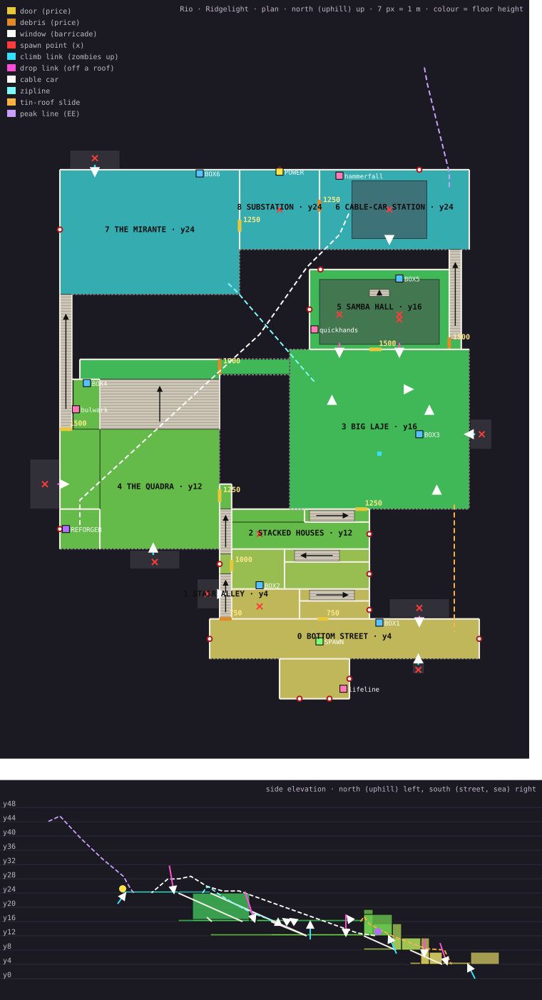

# RIO · RIDGELIGHT — Zombies map design (`favela`)

A round-based Zombies map on a Rio de Janeiro hillside at dusk. The idea is **elevation as a maze**: six terrace
tiers stacked up one hill, joined by stair alleys, room-to-room house interiors, rooftop slabs, a plank bridge
over a ravine, a zipline, a tin-roof slide and a cable car. Players start in a small snack bar on the bottom
street and fight their way up to the power substation at the crest. Once the power is on, the cable car runs, and
the Reforger at its bottom station pulls them back down. The last glow of the sun sits over the sea behind them.

The neighbourhood is portrayed as what it is: a lively, dense, self-built community space (the snack bar, a
five-a-side pitch, a samba school's rehearsal hall, washing on the lines, kites caught on the wires, water tanks
and satellite dishes on every slab) that the undead have overrun. There are **no gangs, drugs, police raids,
weapons caches or poverty caricature**. There are **no real brand names**, no written text in any language (all
signage is abstract shapes and colour blocks), and **no religious symbols**. The landmark tower is a water tower.

Coordinates in this document are design-level. The authoritative numbers live in `src/zombies/maps/favela.ts`
and are checked by `tests/maps/favela.test.ts`. North is **−Z and uphill**. `y` is the walkable floor height.

---

## 1. What made the classic maps work, and how this map applies it

| Principle (BO1-era maps) | What it means here |
|---|---|
| **Loops, not dead ends.** Every area you open reconnects to one you already have, so you can train a horde in a circle. | Four nested loops at different heights (§4). Dead ends are **deliberate and risky**: the Reforger room, two Cache spots, and the water-tower perch. |
| **A readable maze.** Landmarks can be seen from anywhere, and each area has its own light. | The cable-car station and its red beacons at the crest, the cable itself slicing diagonally across the whole map, the blue water tower on the big laje, the floodlit pitch, the mural wall of the samba hall, and the sea at your back. Each tier has its own light colour (§7). |
| **Choice in how to open the map.** | You pick a branch at the first door (stair alley or houses), again for the laje (house hatch or ravine bridge), and again for the climb to power (samba hall and station stair, or the long escadaria to the lookout). |
| **Chokepoints against open ground.** | The narrow becos, house doorways and the 2.4 m station stair are chokepoints. The pitch (26 × 22 m) and the big laje (36 × 30 m) are open training ground. |
| **Pacing.** Start tight, get bigger higher up, keep power far away, and put the Reforger somewhere that needs a trip after power. | Round 1 is fought in an 8 m street and a bar. The spaces widen with every tier. Power sits at the crest (T5). The Reforger is in the **bottom** cable-car station beside the pitch, so turning on the power sends you back down: ride the car (250) or run the escadaria. |
| **The zombies share your map.** | Zombies break through **windows** (with planks you can repair), **climb** retaining walls from the slope below, and **drop** off roof edges above. Walls and roofs spawn zombies, not just windows. |
| **A quest that uses the map's big toy.** | The easter egg restores a third cable line from the station to a **hidden peak** (§9). |
| *Pushing past them* | Traversal verbs the classics never combined in one map: a **one-way zipline** across the ravine, a **tin-roof slide** from the laje to the street, **raised roof slabs** players mantle while zombies vault, and a **cable car** that is transport, the power payoff and the quest all at once. |

---

## 2. Height tiers

The whole hill sits 4 m above the engine's solid ground plane (`y = 0`). That leaves room for the hidden yards
that zombies climb up from, below the parapets.

| Tier | Floor y | Areas | Mood / light |
|---|---|---|---|
| **T0** | 4 | Bottom street, the Lanchonete (snack bar), house row A | Sodium streetlights (deep orange, buzzing), the bar's fluorescent tube, a lit fridge |
| **T1** | 8 | Beco landing, house row B (kitchen, workshop) | Bare bulbs that flicker, warm tungsten |
| **T2** | 12 | Beco top, house row C, **the quadra** (the pitch), the bottom cable-car station (Reforger) | The pitch is dusk-dark until power, then **floodlit cold-white**. Tungsten in the houses. |
| **T3** | 16 | **Big laje** (roof slabs, water tower), the stands walkway, the ravine bridge, **samba hall** | Dusk sky, then chasing festoon strings after power. The hall's neon is magenta, cyan and yellow. |
| **T4** | 20 | Mid-flights of the station stair and the escadaria | Transition tier |
| **T5** | 24 | **Top cable-car station**, **substation** (power), **the mirante** (lookout) | Red beacons before power, cold blue after. The city glows below the lookout. |
| *Peak* | 44 | Hidden summit (easter-egg reward only) | Moonlight |

Height stays legible: the higher you go, the cooler the light and the more of the bay you see.

---

## 3. Plan and side elevation

**`docs/maps/favela-layout.svg` is generated from the def** (`node scripts/map-svg.mjs src/zombies/maps/favela/def.ts FAVELA docs/maps/favela-layout.svg`),
so it is the authoritative drawing. It shows rooms coloured by height, walls (dashed = parapets), doors and debris
with prices, windows, spawn points, climb and drop links, the four ride lines, machines, and a side elevation.



Side elevation (looking west; north and uphill on the left, the street and the sea on the right):

```
 y
 44 |  * PEAK .                                                         (peak line, EE only)
    |         `.
 28 |           `-.  ....cable car.........
 24 |T5 [MIRANTE][SUBSTATION][TOP STATION]    `......
    |      \ escadaria            \ station stair      `.....
 16 |T3     \   [stands walkway]=bridge=[BIG LAJE ~water tower~][SAMBA HALL]   `....
 12 |T2      [ QUADRA / Reforger station ]   [row C]                           ....`[bottom station]
  8 |T1                              [row B][beco landing]      \ tin-roof slide
  4 |T0                                        [row A][BOTTOM STREET][LANCHONETE] -> slope, city, sea
  0 |  (climb yards)                                         ^ zombies climb from here
    +--------------------------------------------------------------------------------------> z (south)
```

Top-down schematic (north and uphill at the top; the SVG has the exact geometry):

```
            x -48          -16  -12      4          34
   z -60  +---------------------+--------+-----------+
          |  MIRANTE (T5)  BOX6 | SUB-   | STATION   |   top tier: power, lookout, cable-car station
          |  zipline start >    |STATION |  Hammerfall
   z -35  +--+ lookout rail ....+--d11---+--d10----+ |
          |E |  ravine (trees, pylon)     SAMBA HALL |S   T3: stage (BOX5), Quickhands, mural
          |S |   ~~~ cable car ~~~        (T3)     d8|T   station stair up the east side
   z -22  |C +==stands walkway==d6=bridge=+---d7---+ |A
          |A |  STANDS  (BOX4, Bulwark)   | BIG LAJE (T3)   water tower, BOX3, roof slabs
    z -8  +d9+----------------------------+  climb up the east parapet, drops off the hall roof
          | QUADRA (T2) pitch + floodlights| zipline lands here     tin-roof slide starts SE
          | REFORGER in the bottom station |         +-----d5 hatch-----+
    z 16  +-- climb yard below ------d4--+  beco   | ROW C (T2) Hullbreaker
                                        |  | d3   | ROW B (T1) BOX2
    z 30  +-----------------------------+d1+------d2-------------------+  slide lands here
          |      BOTTOM STREET (T0)  BOX1 · Warden · roof drops · climb yard below  |
    z 46                  +---- LANCHONETE: Lifeline fridge, Magnus ----+
```

---

## 4. Door graph

Eleven purchases (the number is the price). Yellow means a door or gate, orange means debris:

| Door | Links | Price | Where |
|---|---|---|---|
| `street_beco` (debris: collapsed shutter) | street → stair alley | 750 | beco mouth, T0 |
| `street_houses` | street → stacked houses | 750 | row A front door, T0 |
| `beco_houses` | stair alley → houses | 1000 | beco T1 landing |
| `beco_quadra` (gate) | stair alley → quadra | 1250 | beco top landing, T2 |
| `houses_laje` (roof hatch) | houses → big laje | 1250 | top of row C's stairwell, T3 |
| `quadra_bridge` (debris) | quadra → big laje | 1000 | west end of the ravine bridge, T3 |
| `laje_samba` | big laje → samba hall | 1500 | hall south wall, T3 |
| `samba_station` (debris) | samba hall → station stair | 1500 | hall east wall, T3 |
| `quadra_mirante` (gate) | quadra → escadaria/mirante | 1500 | escadaria foot, T2 |
| `station_power` (debris) | station → substation | 1250 | T5 |
| `mirante_power` (gate) | mirante → substation | 1250 | T5 |

The graph is **2-edge-connected**: cutting any single door never isolates a zone, and every zone except the
street can be opened from two neighbours (`tests/maps-favela.test.ts` asserts both). No wall-buy, machine or
ride sits close enough to a door to steal its E prompt. The test also checks this; it caught two real cases during development.

## 5. Zones and unlock order

| # | Zone (HUD name) | Tier | Size / character | Opens via |
|---|---|---|---|---|
| 0 | **BOTTOM STREET** (+ Lanchonete) | T0 | An 8 m street and a snack bar. Tight start. | start |
| 1 | **STAIR ALLEY** (beco) | T0→T2 | A 2.4 m stair alley with a landing at T1. The purest chokepoint. | d1 750 |
| 2 | **STACKED HOUSES** | T0→T2 | Three rows of rooms up the slope, joined by inside stairs. You fight room to room. | d2 750 / d3 1000 |
| 3 | **BIG LAJE** | T3 | 36 × 30 m of rooftop slabs, water tower, tanks, dishes and washing. Raised roof slabs to mantle. | d5 1250 / d6 1000 |
| 4 | **THE QUADRA** | T2→T3 | Five-a-side pitch, stands, bottom cable-car station (Reforger) | d4 1250 |
| 5 | **SAMBA HALL** | T3→T4 | A big rehearsal hall with a stage and a mural wall | d7 1500 |
| 6 | **CABLE-CAR STATION** | T3→T5 | The station stair (a chokepoint) and the top station | d8 1500 |
| 7 | **MIRANTE** | T2→T5 | The long escadaria and the lookout over the city and the sea | d9 1500 |
| 8 | **SUBSTATION** | T5 | Transformers and the power switch | d10 1250 / d11 1250 |

**Typical opening orders** (all valid; the validator tests that every zone is reachable and that every door has
a reachable side):

- *Beco-first (fast power)*: d1 → d4 → d9 → d11 → **power** (4,750). Then take the gondola down to the Reforger.
- *Houses-first (perk + box value)*: d2 → d5 → d7 → d8 → d10 → **power** (6,250). You pass three perks and
  three Cache spots on the way.
- *The full ring*: d1 → d3 closes the low loop early (1,750). Then d4 → d6 closes the mid loop.

---

## 6. Loops, routes and traversal

**Loops (all zombie-walkable):**

1. **Low loop (T0–T2), tight.** Street → beco flight 1 → T1 landing → d3 → row B → inside stair down → row A →
   d2 → street. About 60 m around. It is good for rounds 1–5 but punishing later.
2. **Mid loop (T2–T3), the big one.** Beco top → d4 quadra → the stands → bridge (d6) → big laje → hatch (d5) →
   row C → row B → d3 → beco landing → beco top. About 180 m around. It crosses the ravine twice by height.
3. **Pitch loop (T2).** Run circles around the pitch. The stands let you bail upward.
4. **High loop (T3–T5).** Laje → d7 samba hall → d8 station stair → top station → d10 substation → d11 mirante →
   escadaria down → quadra → stands → bridge → laje. About 320 m around. This is the late-game marathon.
   The laje water tower sits at its centre.

**Player-only verbs (zombies go round the long way, and this is where you make space):**

| Verb | From → To | Notes |
|---|---|---|
| **Cable car** | Bottom station (T2) ⇄ top station (T5) | Works after power. Costs 250 and the ride takes 14 s over the stands and the ravine, via a pylon. Two cabins run in counter-motion. It is the natural trip to the Reforger after power. |
| **Zipline** | Mirante (T5) → big laje (T3), across the ravine | One way and free. 3.4 s. Needs both ends unlocked. |
| **Tin-roof slide** | Laje SE corner (T3) → street east end (T0) | One way and free. 2.6 s down a cascade of corrugated roofs. It is the emergency exit from the laje. |
| **Roof slabs** | Raised units on the laje (0.8 m and 1.6 m) | Players mantle up. Zombies vault via authored nav links. |
| **Ladder** | Laje → water-tower roof (y 24.35) | A dead-end sniper perch and an EE step. Zombies climb it too. |

**Zombie verticality.** Every zone mixes three entry kinds:

- **window**: a barricade with 6 planks and a rebuild prompt (bar back windows, house rooms, samba hall, station).
- **climb**: zombies scale a retaining wall or parapet from the slope below. The quadra's south wall, the laje's
  east parapet and the street's south edge have these. There are no planks, but there is a short, readable climb.
- **drop**: zombies step off a roof edge above the zone and fall in (above the street and beco, off the samba
  roof onto the laje, off the station roof). There is a tell before each one: dust falls and the zombie groans overhead.

---

## 7. Lighting (dusk)

- **Sky:** a warm band of orange and rose over the sea to the south, fading through violet to deep blue at the zenith. There
  are a few early stars and a low sun disc just set. Fog is warm-grey near the ground, and it thins with height, so the
  crest is sharper.
- **City below and the sea:** several thousand instanced window lights on the downhill slope and the city beyond, a
  line of streetlights along the shore, and a sea plane with a sunset streak.
- **Before power:** sodium streetlights on T0 and T1 (they buzz and flicker), bare bulbs in the houses (random
  flicker), and a dim pitch lit only by the dusk sky. The station beacons blink slowly on backup power, so you can see
  the goal from the start.
- **After power:** the pitch floodlights slam on, one mast at a time, and the laje festoon lights run in a chase.
  Neon comes on in the samba hall (magenta and cyan abstract shapes) and on the bar front. The cars and the station
  light up, and the Reforger's graffiti glows under UV.
- Light budget: exactly 12 real shadowless point lights (the MAP_API guideline, asserted by a test). The rest is emissive
  sprites and light-pool decals, the same as the existing maps.
- **Fixtures (art pass):** 9 sodium street lamps (curved arm, cobra head) and 17 wall lamps on every tier (street,
  beco, laje, the escadaria, the station stair, the mirante, the substation, the bar), each with a glow halo (one
  `Points` draw per colour, buzzing with the sodium flicker) and a warm light pool on the floor below it (one
  instanced draw). Lit windows: every glass pane of every placed house is lit or dark on its own (about a quarter lit),
  in warm tungsten, pale LED, cool fluorescent or TV blue.
- **After power (art pass):** festoon strings also run criss-cross under the samba hall roof, up the escadaria and
  twice across the mirante; the hall gets a stage backdrop mural and pennant bunting (bunting is there before power).
- **Dark walls fixed:** the walls were dark because the kit had no UVs at runtime (see §10), the paints were the engine's
  grey plaster and the fill was low. Now: procedural surfaces with brighter albedo, hemisphere fill 0.7 -> 1.05
  (post-power 0.6 -> 0.9), and see-through railings where there were solid steel parapets.

---

## 8. Machines, perks and the Cache (all reimagined, no text, no brands)

| Thing | Where | Look |
|---|---|---|
| **Lifeline Soda** (500, works without power) | Lanchonete, T0 | The bar's glass-door drinks fridge, painted with pale-blue street-art waves |
| **Bulwark Brew** (2500) | Under the stands, quadra T2 | A red drinks cooler with a street-art shield-shape mural |
| **Quickhands Fizz** (3000) | Samba hall, T3 | A lime-green vending machine covered in lightning-shape graffiti |
| **Hammerfall Root** (2000) | Top station, T5 | An orange machine with bold hammer-shape stencils |
| **The Reforger** (PaP) | Bottom cable-car station (quadra, dead end) | A cable-winch motor covered in street art and driven by the station's bull wheel. It starts spinning when the power comes on. |
| **The Cache** (box) | 6 spots on five floors: street (start), row B kitchen, laje by the water tower, the stands corner, the samba stage, the mirante | A wooden crate painted with abstract waves, a sun and triangles (Meshy, retextured) |
| **Power switch** | Substation, T5 | The stock breaker between two Meshy transformers |

Wall-buys are chalk outlines as usual. The early guns sit low and the rifles sit high: Warden (street), Magnus (bar),
Wren (row A), Hullbreaker (row C), Kestrel (the laje face of the samba hall), Skiff (quadra), Corvid (samba hall),
and Sentry DMR (mirante, for the long view).

---

## 9. Easter egg — "Last Ride to the Peak"

This runs on the generic egg step machine plus the ride API:

1. **Find the three cable grips** (collect, needs power). They are in the beco drain at the T1 landing, beside the big drum
   on the samba stage, and on the water-tower roof (up the ladder).
2. **Refit the peak line** (interact) at the station's third bull wheel, NE corner of the top station.
3. **Hold the station** (kill step: 24 kills inside the station zone). Zombies drop off the canopy while the car
   comes down from the peak.
4. The peak line opens (`requiresEggStep: 3`). **Ride it to the summit** (y 44, above the lit city) and **take what
   the peak keeps** (interact). The reward is the Arc Projector (wonder weapon), +5000, a free reforge of the held
   gun, full ammo and a Max Ammo drop. The ride back down is next to the pedestal.

## 10. Assets (as built)

Everything lives in `public/models/favela/`: **10.3 MB of GLBs** (the art pass added about 3 MB; budget 22 MB). The map
geometry itself is procedural data, so the map is playable before any GLB arrives; the models stream in afterwards and
merge into the hillside as they land (progressive).

### Art pass (branch `favela-art`)

**Surfaces, 0 bytes of download** (`src/zombies/maps/favela/materials.ts`, the map entry's `materials()` library, def
`MatSpec.custom: 'fv:*'` keys). Tileable 512 px PBR sets baked on a canvas at load (1 UV = 2 m): the hollow ceramic
favela brick with thick, sloppy grey mortar; painted cement render (roller marks, hairline cracks); raw cast
concrete with formwork lines; walked-on slab. A small shader patch, `fvDetail`, adds what a tiling texture cannot:
world-space macro colour drift, rain streaks that darken down from every storey line, and on painted render ragged
patches where the render has fallen off and the brick shows through (more of them low on the wall, rising damp).
The def's paints are 8 colours (the street front is now 8 houses of different colours, split at points no door
crosses), the ceilings are pale render, and every surface of the Blender kit maps onto the same library.

**Blender kit v2** (`tools/blender/favela_kit.py` + `favela_houses.py` + `favela_dress.py`, 0 credits):
- **14 self-built houses** (`fv_h01`–`fv_h14`, 1 to 4 storeys, 1.7k–3.2k triangles) plus a ~100-triangle `.lod1`
  shell each: concrete frame with corner columns and slab edges that stick out past the walls, per-storey exposed
  brick or painted render, real window openings (reveals, recessed glass, aluminium frames, sills, iron grilles,
  open shutters, AC units), steel or wood doors under a small canopy slab with a meter box and a wire, a roll-up
  shopfront with a striped awning, balconies with railings and washing, storeys that overhang or step back behind a
  railed terrace, outside stairs with pipe handrails, downpipes, breeze-block vents, and one of four tops (flat laje
  with parapet, an unfinished storey with rebar and a half-built wall, corrugated tin roof, fibre-cement roof) with
  water tanks, dishes and a washing line. Every placement gets its own render colour (vertex colour), is mirrored at
  random and lights its own set of windows.
- **Dressing:** banana plants, a coconut palm, two broad tropical trees, a bougainvillea planter, a green shrub,
  a cluster of potted plants in tins, a fruit stall with a striped awning, a snack kiosk with an umbrella, a
  chain-link fence panel (alpha-tested), a substation gantry with insulators, the **cable-car station hall** on the
  crest (barrel roof, glazing band, the bull wheel under the roof, red beacons: it receives the line behind the top
  station), the bottom station's curved roof cap, the lanchonete awning, a concrete bench, a lookout viewer, and a
  new tapered utility pole (transformer can, insulators, junction boxes) and cobra-head street lamp.
- Pipeline: `blender -b --factory-startup -P tools/blender/favela_kit.py -- --out public/models/favela`, then
  `node scripts/compress-kit.mjs --dir public/models/favela --keep-uv`. **`--keep-uv` is new and matters:** the plain
  `prune()` stripped `TEXCOORD_0` from every untextured slot, so the whole kit shipped without UVs and every tiling
  texture sampled one texel (the flat, dark walls of the first build). The flag keeps the UVs as floats.

**Draw calls:** the kit's ~40 material slots fold into pools: brick, render, concrete, dark concrete, corrugated
sheet (vertex-coloured: tin, fibre-cement, rust, shutters), glass (dark / lit), one vertex-coloured "flat" pool for
every small painted part, plant and fence post, and one self-lit mural pool. About 250 houses, 150 plants and all the
street furniture cost about a dozen draws. The def's dressing props (`DRESS_PROPS`, formerly `PropDef`s) are drawn
as one `InstancedMesh` per model with invisible box colliders of exactly the same footprint; every cable, wire and
festoon wire is one mesh, all festoon bulbs one instanced mesh (the chase is written into instance colours), the neon
one mesh, the procedural facade bits and railings one mesh.

**Backdrop:** layered ridge bands around the bay (open to the sea at the mouth) and two generic bare-granite domes
at the water's edge, vertex-coloured with their own dusk light and haze (one unfogged draw, inside the camera's
700 m far plane). They are generic peaks, not a copy of any real landmark.

**Meshy: 0 credits spent in the art pass.** The planned batch (hero houses, a hillside cluster, a granite peak, a
banana plant, then market stalls, a samba float, station, gantry, plants; ~30 credits each, cap 900) was not run:
the runner's first call was refused by this session's permission policy, so everything above is procedural. The
queued prompts and the exact command are in `assets/LOG.md`. What Meshy would still add: detailed hero facades for
the few houses nearest the street and laje, a samba float, market-stall and plant heroes with real textures.

### Earlier assets (map-favela branch)

**Blender kit v1, 23 pieces**: six background houses (replaced by the v2 houses above and deleted), pole, lamps,
floodlight mast, pylon, ladder, railing, tin roof, rebar, grille, kite, laundry, three murals as geometry (no text,
no symbols), the station canopy and a goal frame.

**Meshy, 710 of the 1,200-credit cap** (ledger in `assets/gen-state.json`, batches in `assets/LOG.md`):

| Batch | Credits | What |
|---|---|---|
| reuse from mp-assets | 20 | house block (now unused, deleted from public), barrel and gas cylinder fetched by finished task id (0); water tank and satellite previews refined (2 × 10) |
| stage 1 | 390 | gondola cabin, bull wheel, transformer, bar counter, fridge, motorbike, wire bundle, goal, samba drums, speakers, costume rack, table + chairs, water tower |
| stage 2 | 180 | perk machines ×4, Reforger, Cache |
| retexture | 120 (logged at 20 each) | The "graffiti" prompts produced lettering ("PBR", tags), so all six machines were retextured with letter-free abstract-shapes prompts (`scripts/meshy-retexture.mjs`) |

The gondola cabin's texture carried pseudo-lettering and is cleaned by `scripts/scrub-text.mjs`. Lesson: never write
"graffiti" or "tag" in a prompt.

## 11. Implementation notes

- **Def**: `src/zombies/maps/favela/def.ts`, pure data plus two helpers (`cablePath`, `becoY`). Staging rooms
  (`name: 'STAGING'`) give the off-map roofs and yards that zombies drop or climb from a zone, so the validator and
  the director treat them properly.
- **Entry + surfaces**: `entry.ts` registers the def with `materials.ts` (the procedural `fv:*` surface library) and
  the decorate hooks; `maps/index.ts` imports the entry.
- **Decorate**: `src/zombies/maps/favela/decorate.ts`. It builds a visual hillside terrain (kept below every play
  floor), about 250 kit houses (detailed within 9 m of the play space, `.lod1` shells beyond; skins in front of the
  terrace faces never rise above the floor they dress, and no scatter house beside a terrace rises above that
  terrace) **merged per material pool** into about a dozen meshes, trees and plants merged into the same pools, about
  1,500 instanced far houses and city blocks, 5,200 city lights as one `Points`, the sea, ridges and domes, the sunset,
  the cable line and cabins, all cables and wires as one tube mesh, festoon bulbs as one instanced mesh, floodlights,
  murals, neon, lamp fixtures with glow points and light pools, the dressing props (instanced, see §10), the facade
  detail on the def's long walls, see-through railings, and **invisible fall guards** (movement-only colliders above
  every parapet, railing and climb gap).
- **Update**: animates the cabins from the ride state, festoons chasing after power, neon flicker, sodium buzz
  and the floodlight heads.
- **API extensions.** zcore upstreamed the shared ones as its canonical API: `machines` (per-map machine GLBs
  and perk footprints), `BoxDef.mat: null` (invisible colliders) and `EggReward.weapon`. Favela adds three more
  on top, all additive and documented in `docs/MAP_API.md`:
  - `rides` (`src/zombies/rides.ts`, plus a player pin in `Game.ts`);
  - `PropDef.lod` (THREE.LOD with generated `<id>.lod1.glb` twins; the favela itself now draws its props through
    `DRESS_PROPS` instead);
  - `ride` / `eggStep` in the map update context.
- **Tests**: `tests/maps-favela.test.ts` covers the validator, the 2-edge-connected door graph, tiers, the power
  cost, Reforger placement, box floors, spawn kinds, doors that must not be shadowed by other prompts, ride
  clearance against compiled colliders and the egg gating. `tests/zombies-rides.test.ts` covers the pure ride logic.
- **Play-through**: `e2e/favela-play.mjs` (headless, real E presses): rounds, all 11 doors in order, pre/post-power
  zone shots, power, perks, Cache, cable car, Reforger, zipline, slide and the full egg. `e2e/favela-look.mjs` is a
  quick camera tour.

## 12. Verification and known issues

**Headless play-through** (`BASE=http://127.0.0.1:5183 node e2e/favela-play.mjs /tmp/favela-shots`, on the
no-reload dev server `vite --config e2e/vite.noreload.config.mjs`). Every check passes:

- spawn in the bottom street;
- zombies climb from the yard (y 0) into the street and drop off the roof ledge (y 10). The director also picks
  both kinds on its own;
- a full round cleared in the street;
- all **11 doors bought with E** in unlock order from the correct side;
- the power switch;
- all **4 perks**;
- the **Cache** (a weapon handed over);
- the **cable car** carries the player down to the bottom station;
- the **Reforger** upgrades the held gun (tier 0 → 1);
- the **zipline** and the **tin-roof slide** both land at their ends;
- the **easter egg**: 3 grips, refit, 24 kills holding the station, the peak line to the summit, and the Arc
  Projector handed over.

Screenshots of every zone before and after power: `/tmp/favela-shots/{pre,post}-*.png`. Also captured: the climbing and
dropping zombies, the rides, the Reforger, the hold and the peak view.

**Frame stats** (headless swiftshader, so software rendering: the ms figures are not representative). Draw calls
and triangles are the numbers to watch:

| Where | Draw calls | Triangles |
|---|---|---|
| Street fight (round 1–2) | ~230 | ~450k |
| Zone tour, before / after power | ~185–190 | ~325–355k |
| Summit view over the whole map with zombies about | ~325 | ~425k |

For comparison, the stock Nightfall map measured 327 draw calls and 132k triangles on this harness before zcore's perf pass.

**Art pass, real GPU** (NVIDIA GB10 through ANGLE/GL-EGL, headless chromium, 1280×720, all doors open, a 16-view tour
before and after power; the GPU was shared with other agents' browsers, so ms are indicative). Before = the
map-favela build, after = favela-art:

| View | Calls before → after | Triangles before → after | Frame ms after |
|---|---|---|---|
| Bottom street | 302 → 239 | 367k → 536k | 7.5 |
| Stair alley | 297 → 236 | 377k → 545k | 7.9 |
| Big laje | 267 → 216 | 333k → 497k | 8.0 |
| Quadra, wide | 275 → 221 | 320k → 510k | 7.4 |
| Samba hall | 212 → 167 | 307k → 466k | 7.7 |
| Station, looking over the bay | 285 → 226 | 333k → 503k | 11.0 |
| Mirante | 266 → 218 | 296k → 497k | 7.6 |
| Substation | 186 → 151 | 295k → 429k | 7.5 |

`GPU=1 MAP=favela node e2e/zombies-perf.mjs` (24+ zombies chasing, five rooms): calls 271–373 → 212–312, mean frame
13.6 → 14.7 ms (both runs contended; about 68–73 fps). Calls include the sun's shadow pass (~50). Without the map's own
dressing a wide view is ~150 calls of engine runtime (compiled walls per material, door kits, window planks,
machines, signs, chalk) plus the shadow pass, which is why the widest views still sit at 215–240.

**Known issues**
- Wide views run at 215–240 calls, over the 200 target; the map-owned part is ~45 (a dozen pools, instanced props,
  one mesh each for cables, festoons, neon, bits, glows, pools, sky pieces). The rest is shared runtime; the next
  savings are engine-side (instanced door/debris kits and window planks, fewer batch chunks, a tighter shadow frustum).
- Triangles went up by ~170k per view (detailed houses within 9 m of the play space, trees). The GB10 does not
  notice, but the swiftshader e2e runs are slower; a weaker GPU could lower the LOD0 margin in `buildHouses`.
- The painted render shows brick through ragged patches everywhere (shader noise), including interiors; under the
  samba hall's magenta light they read as red specks.
- Meshy was not used in the art pass (see §10), so there are no hero facades, samba float or textured plants.
- The spawn director prices a spawn point by its own height (height difference counts 3× as distance), so climb
  yards and roof ledges read as "far" even though they deliver onto the player's floor. The def compensates with
  weights of 2.5–4. A `deliversTo` height on `SpawnPointDef` would be the clean fix.
- In one early run, a window zombie was seen outside the west street window's walled pocket and fell to the
  ground. Pockets are built by the shared compiler. It was not reproduced.
- The peak pedestal is reachable only by ride, so the validator emits one expected `egg-unreachable` warning.
- Co-op is untested (the modes are single-player until M3). Rides pin only the local player.
- Door signs use the game's standard English "SEALED / DEBRIS" plates. Everything map-specific (murals, machines,
  neon, kites, laundry) carries no text.
